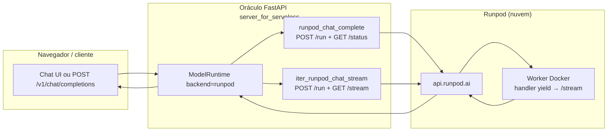

# Oráculo (`server_for_serveless`) + Runpod Serverless

Este documento explica **como o backend nesta pasta fala com o Runpod**, o uso de **`/status` vs `/stream`**, como a resposta chega à interface em **tempo real (deltas do modelo)** quando o chat usa SSE, e o **ciclo de vida dos workers** GPU.

---

## 1. Visão geral da arquitetura

- **Oráculo** continua a ser o único sítio onde o utilizador autentica, grava histórico no PostgreSQL e aplica limites do **admin** (`n_ctx`, `max_new_tokens`, `temperature`, `top_p` em `app_global`).
- **Runpod** só executa o **job de inferência**: recebe `messages` + sampling, corre o modelo no GPU, devolve texto.
- Não existe ligação direta do browser ao Runpod: todo o tráfego passa pelo Oráculo (e a **API key do Runpod** fica no servidor, não no cliente).

---

## 2. Como o projeto escolhe Runpod em vez de llama-server HTTP

Em `inference/bootstrap.py` (`load_inference_backend`):

1. **Runpod** quando o admin activa **Runpod Serverless** na UI (`app_global.runpod_serverless_enabled = 1`). Endpoint, chave, `model id`, tempos de poll e *startup health* ficam na BD; campos vazios na BD usam fall-back `ORACULO_RUNPOD_*` no `.env`.
2. **Llama-server HTTP** com a opção **desligada** (omissão): host/porta no admin e/ou `ORACULO_LLAMA_CPP_BASE_URL` / omissão local.

Variáveis úteis no `.env` (fall-back ou só `.env` sem preencher admin; ver também `.env.example`):

| Variável | Função |
|----------|--------|
| `ORACULO_RUNPOD_ENDPOINT_ID` | ID do endpoint Serverless no painel Runpod |
| `ORACULO_RUNPOD_API_KEY` | Chave `rpa_...` (API) |
| `ORACULO_RUNPOD_MODEL_ID` | Nome do modelo exposto em `/v1/models` (ex.: `runpod`) |
| `ORACULO_RUNPOD_POLL_TIMEOUT_S` | Tempo máximo à espera do job (omissão 900 s) |
| `ORACULO_RUNPOD_POLL_INTERVAL_S` | Intervalo entre pedidos `GET /status` (omissão 1 s) |
| `ORACULO_RUNPOD_STARTUP_HEALTH` | Se `1`, no arranque faz `GET .../health` no endpoint |

**Outras definições globais (admin / `app_global`):** fila de geração, aviso «outro a gerar», modo só interface (`ORACULO_UI_ONLY` / `--ui-only`), etc., em *Configurações do modelo*.

Opcional: *startup health* (admin ou `ORACULO_RUNPOD_STARTUP_HEALTH`) faz `runpod_endpoint_health` ao carregar o backend.

---

## 3. Padrão de comunicação com a API Runpod (inferência)

O cliente está em `inference/runpod_upstream.py`.

### Resposta completa (chat sem `stream`, ou `generate()`)

1. **`POST .../run`** com `{"input": { messages, max_tokens, temperature, top_p }}` → devolve `job_id`.
2. **`GET .../status/{job_id}`** em ciclo até `COMPLETED` → `output` agregado (com `return_aggregate_stream` no worker, o texto final continua disponível aqui).
3. **`_parse_worker_output`** trata string, `error`, ou `output` aninhado.

### Resposta em streaming (UI com SSE / token a token)

1. **`POST .../run`** (mesmo `input`).
2. **`GET .../stream/{job_id}`** com corpo incremental (linhas JSON) enquanto o worker faz **`yield`** dos deltas.
3. O **worker** (`handler.py` na raiz do repo) tem de ser um **streaming handler**: faz SSE ao `llama-server` local (`stream: true`) e repassa cada delta de `content` para o Runpod (`runpod.serverless.start` com `return_aggregate_stream: True`).
4. O Oráculo repassa cada delta ao gerador `stream()` → `/v1/chat/completions` com `stream: true` continua em SSE real em relação ao GPU (latência ponta a ponta), limitada ao ritmo do worker + rede.

Se `/stream` falhar (worker antigo), aparece erro a pedir **rebuild da imagem Docker** do worker com o `handler.py` atual.

**Contrato com o worker:** o `input` é o mesmo nos dois modos. O worker fala com `http://127.0.0.1:{LLAMA_PORT}/v1/chat/completions` (completions em modo não-stream para agregados via status, e em modo stream para yields).

---

## 4. “Streaming” na tela

| Modo | Comportamento |
|------|----------------|
| **llama-server HTTP** | `chat_completions_stream_deltas`: SSE direto do llama-server. |
| **Runpod** | `iter_runpod_chat_stream`: SSE do llama-server **dentro do worker** → Runpod `/stream` → Oráculo → cliente. Os pedaços correspondem aos **deltas do modelo** (tokens / subpalavras), não a uma simulação após texto completo. |
| **Runpod, pedido sem stream** | `runpod_chat_complete` usa só `/status` após `/run`. |

Cancelar no cliente (`cancel_event`) solicita **`POST .../cancel/{job_id}`** no Runpod e interrompe a leitura do stream.

### Nota

Implementação anterior (chunking fixo ~24 caracteres após resposta completa) foi **substituída** pelo fluxo acima — **é obrigatório** redesenhar o contentor Runpod com o `handler.py` em streaming descrito no repositório.

## 5. Workers GPU: “fechar” e consumo de processamento

Importante: **o Oráculo não abre nem fecha manualmente um worker Runpod**. Cada pedido de inferência:

1. Enfileira um job (`POST /run`).
2. O Runpod atribui (ou reutiliza) um **worker** que executa o contentor (com `handler.py` + `llama-server`).
3. Quando o job passa a `COMPLETED` (ou falha), esse ciclo de trabalho **termina** do ponto de vista da tua app.

O que acontece **ao contentor GPU** depois disso é **política do endpoint** no painel Runpod, por exemplo:

- **Escalar a zero** / **tempo de idle** — após um período sem jobs, os workers são desligados e **deixam de consumir GPU**.
- **Workers mínimos** / **keep warm** — podes manter instâncias quentes para latência mais baixa, ao custo de uso contínuo.

**Não há** chamada neste código para “matar o worker” após cada resposta: isso controla-se nas **definições do endpoint Serverless** no Runpod. O processo Python do Oráculo só mantém **ligações HTTP curtas** (`httpx`) a `api.runpod.ai` por job; não mantém socket aberto para o GPU entre pedidos.

---

## 6. Resumo mental rápido

| Questão | Resposta curta |
|---------|------------------|
| Quem fala com o Runpod? | Só o backend `server_for_serveless` (`runpod_upstream.py`), com a API key no `.env`. |
| É uma só requesição HTTP? | Não: `POST /run` + (`GET /status` em ciclo **ou** `GET /stream` contínuo, consoante o caminho). |
| O utilizador vê streaming real do modelo (SSE)? | **Sim**, se a UI usar `stream: true`: deltas vêm do llama-server no worker via Runpod `/stream`. Sem stream, só `runpod_chat_complete` + `/status`. |
| Como alinhar defaults com o admin? | O Oráculo lê `app_global` para caps e sampling; o worker usa o que vai no `input` (e pode ter `DEFAULT_*` no contentor como cópia manual). |
| Como evitar GPU ligada sem uso? | Configura idle / max workers no Runpod; não depende de código extra no Oráculo. |
| Fila global vs paralelo no Oráculo? | **Admin** → *Configurações do modelo* → «Fila global» (ou `app_global.inference_single_flight`). |
| Aviso “outro utilizador a gerar”? | Com fila activa: opção **Admin** *bloquear quando outro gera* (`app_global.ui_block_cross_user_generation`). |

---

## 7. Referências no repositório

- Cliente Runpod: `server_for_serveless/inference/runpod_upstream.py` (`runpod_chat_complete`, `iter_runpod_chat_stream`)
- Escolha llama vs Runpod: `server_for_serveless/inference/bootstrap.py` (`load_inference_backend`); geração e fila global: `server_for_serveless/inference/runtime.py`
- Arranque e envs: `server_for_serveless/main.py`
- Worker de exemplo (Docker na raiz do repo): `handler.py`, `Dockerfile`
- Documentação Runpod (API): https://docs.runpod.io/serverless/endpoints/operation-reference

Para instruções gerais de instalação e PostgreSQL, vê `README.md` nesta mesma pasta.
